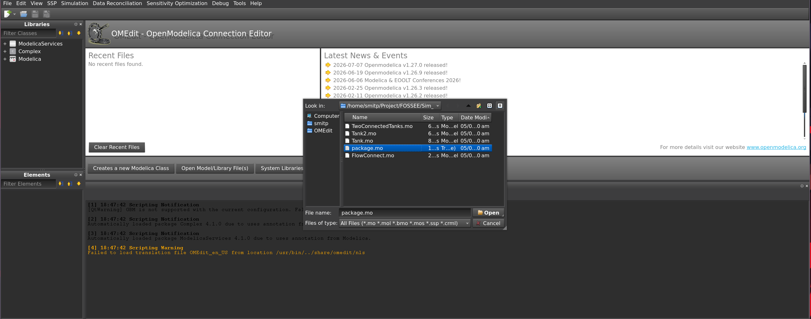
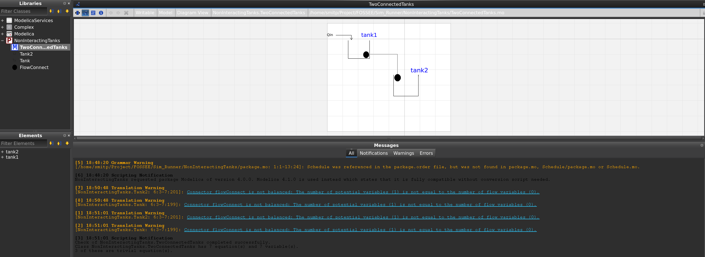
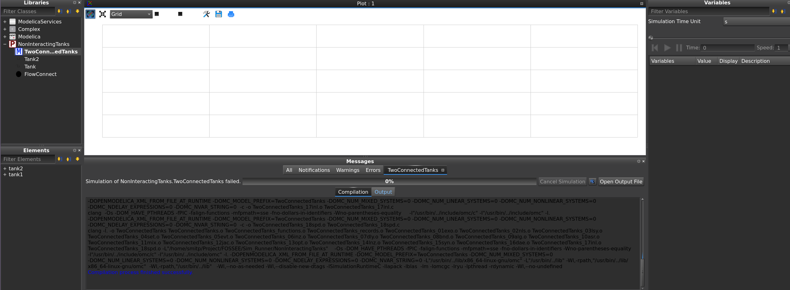
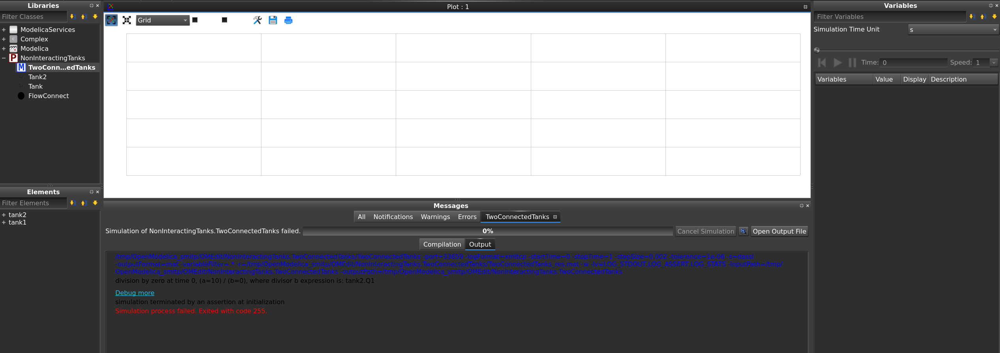

# OpenModelica Compilation Guide

Step-by-step walkthrough for loading, compiling, and extracting the executable for the `TwoConnectedTanks` model in OpenModelica (`OMEdit`).

---

## Step 1: Open the Model Package

1. Launch **OMEdit**.
2. Select **File** → **Open Model/Library File(s)**.
3. Locate and select `package.mo` from the model source directory.



---

## Step 2: Load the Model Hierarchy

Once loaded, the package tree appears under the **Libraries** browser as `NonInteractingTanks`.

1. Expand **NonInteractingTanks**.
2. Double-click **TwoConnectedTanks** to load the model diagram.



---

## Step 3: Build the Executable

1. Right-click **TwoConnectedTanks** in the Libraries browser.
2. Select **Build Model** (`Ctrl+Shift+B`).

> Building compiles generated C code and produces the runtime executable plus initialization metadata.



---

## Step 4: Output Artifacts

Compilation writes files into your working directory (e.g. `/tmp/OpenModelica_$USER/OMEdit/...`):

* `TwoConnectedTanks` — Linux binary executable
* `TwoConnectedTanks_init.xml` — model initialization parameters (**required at runtime**)
* `TwoConnectedTanks_res.mat` — simulation output dataset
* `TwoConnectedTanks_JacA.bin` — cached Jacobian sparsity pattern (**do not copy this one — see note below**)



> **Note:** `TwoConnectedTanks_JacA.bin` was found during testing to trigger a division-by-zero assertion for start times in `[0, 5)` when present alongside the executable. It is not a required runtime file — omit it. See the main [README](../README.md#excluded-file-note-twoconnectedtanks_jacabin) for full details.

---

## Files to Copy for GUI Execution

Only two files are needed by the PyQt app:

```text
model/
├── TwoConnectedTanks          # main executable
└── TwoConnectedTanks_init.xml # required runtime config
```

The `.mo` source files are not required at runtime — they're needed only if recompiling the model in OMEdit.