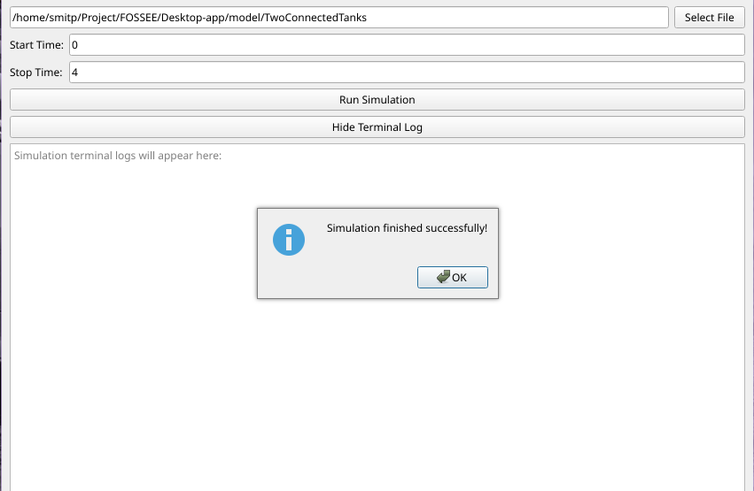
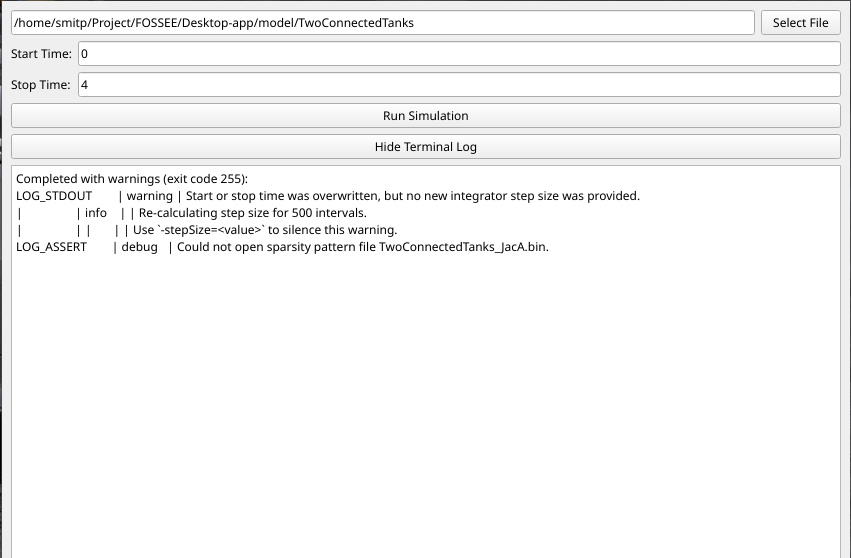

# PyQt OpenModelica Sim-Runner

A desktop GUI application built with Python and PyQt6 that configures and executes a pre-compiled OpenModelica simulation model (`TwoConnectedTanks`). 

## 🗂️ Repository Structure
*   `app.py`: Main PyQt6 Application script
*   `model/`: Compiled OpenModelica executable and FMI XML
*   `model-package/`: Original Modelica source code (.mo files)
*   `output/`: Generated simulation results and logs

## ⚙️ Requirements
*   Python 3.6+
*   PyQt6 (`pip install PyQt6`)
*   Linux OS with OpenModelica installed (required for runtime `.so` libraries)

## 🚀 Usage Instructions

**1. Clone the Repository:**
Open your terminal and run:

For Linux and macOS:
```bash
git clone https://github.com/smitpatil06/Sim-Runner
cd Sim-Runner
```

For Windows (Command Prompt / PowerShell):
```
python -m venv .venv
.\.venv\Scripts\activate
pip install PyQt6
```

**2. Install the required Python packages.**
```
python3 -m venv .venv
source .venv/bin/activate
pip install -r requirment.txt
```
**3. Open a terminal in the root directory.**
```
python app.py
```

**4. Click **Select File** and select the `TwoConnectedTanks` executable in the `model/` folder.**

**5. Enter a **Start Time** and **Stop Time**.**

**6. Click **Run Simulation**.**

**7. Upon completion, the console output will populate the GUI's terminal view, and a `.mat` file will generate in the `output/` folder.**






**## 💡 Developer Notes**

*   **Execution Logic:** The app uses `subprocess.run()` to launch the executable. This is a blocking call; the app waits for the simulation to finish before capturing and displaying `stdout`/`stderr` in the UI.
*   **Arguments:** The times are passed as standard flags: `-startTime=X -stopTime=Y`.
*   **Exit Code 255:** The `TwoConnectedTanks` executable returns exit code `255` upon successful completion with warnings (e.g., missing sparsity files). The `SimulationRunner.run()` method explicitly maps this code to a success state to prevent false negative popups. 
*   **OS Dependencies:** The executable relies on OpenModelica dynamic libraries (e.g., `libSimulationRuntimeC.so`). Ensure OpenModelica is installed per Step 1 of the task requirements.